#   TIMERS lpc1769 Ejemplo
Proyecto ejemplo para controlar el sensor ultranónico HC-SR04 con el micro controlador LPCXpresso lpc1769.
El ejemplo enciende un led cuando se coloca un obstáculo a menos de 5cm de distancia del sensor ultrasónico,

- IDE: [MCUXpresso IDE](https://www.nxp.com/design/software/development-software/mcuxpresso-software-and-tools-/mcuxpresso-integrated-development-environment-ide:MCUXpresso-IDE).
- Lenguaje: C.
- Microcontrolador: [LPCXpresso lpc1769 rev C](https://www.embeddedartists.com/products/lpc1769-lpcxpresso/).
- Sensor Ultrasónico HC-SR04

---
## LPCXpresso LPC1769
 

### PCONP

### PCLKSELx
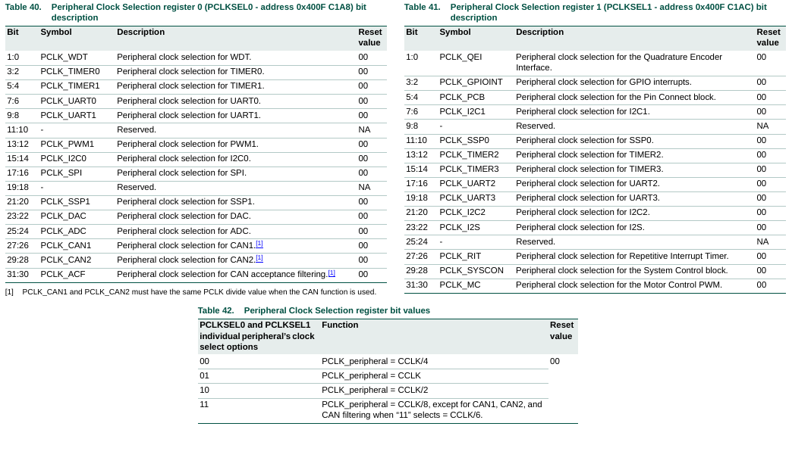

### ISER0
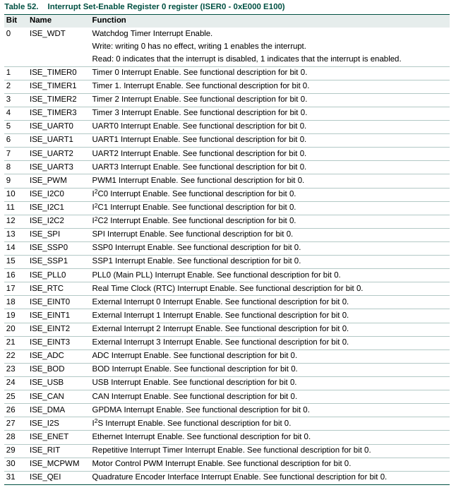

### TIMERx - REGISTROS
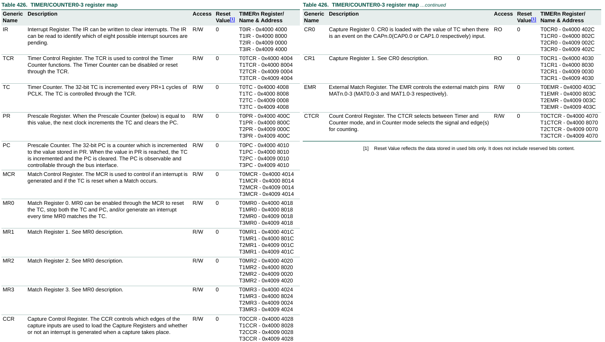
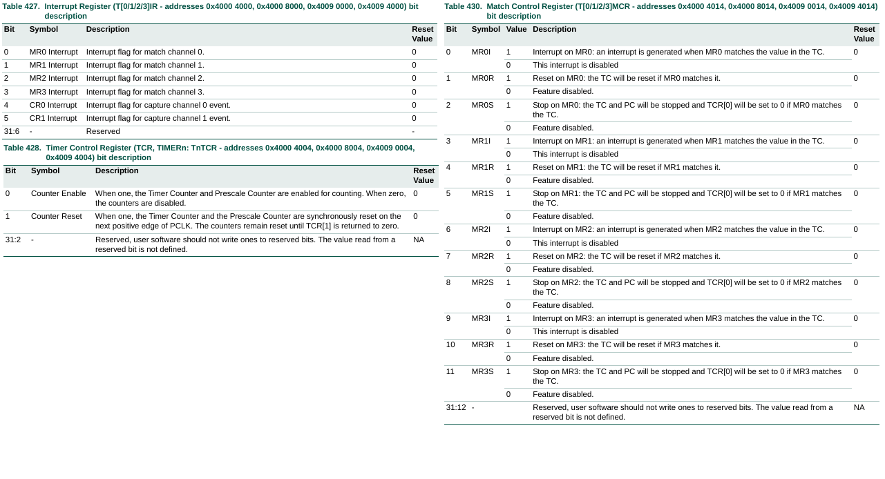
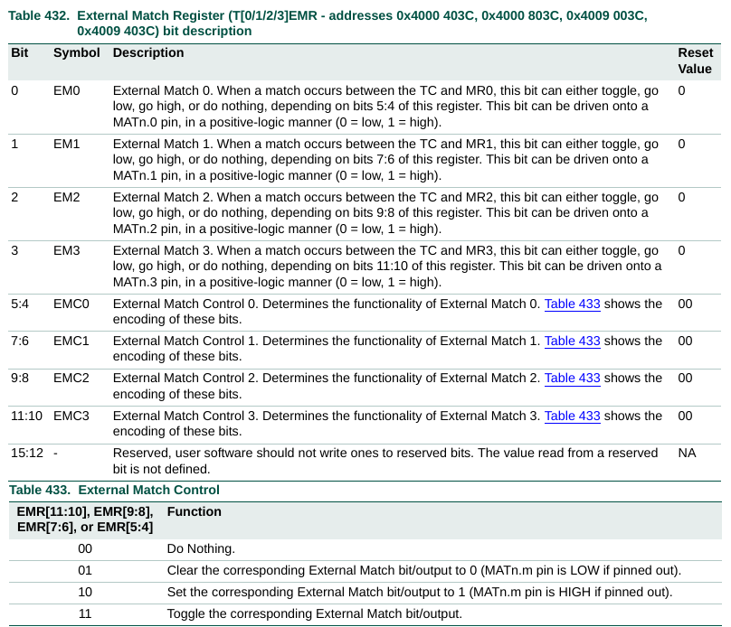

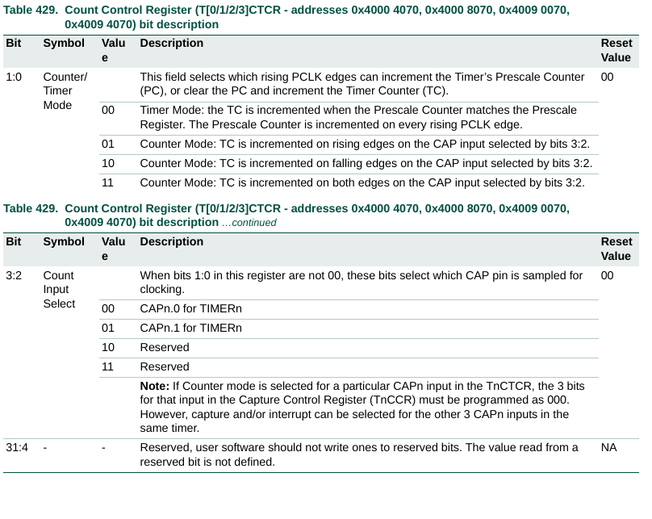
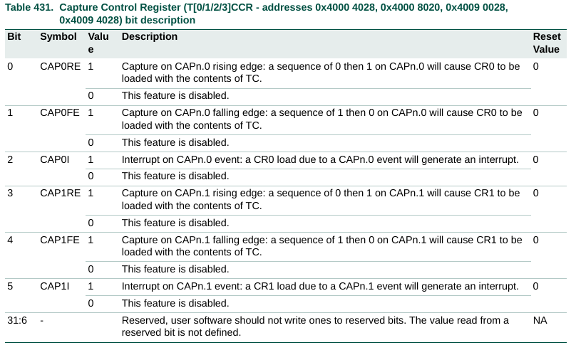

## SENSOR ULTRASONICO HC-SR04
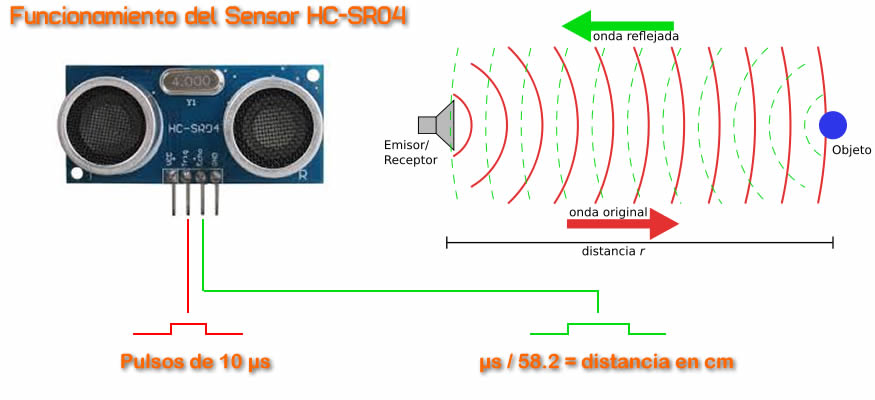
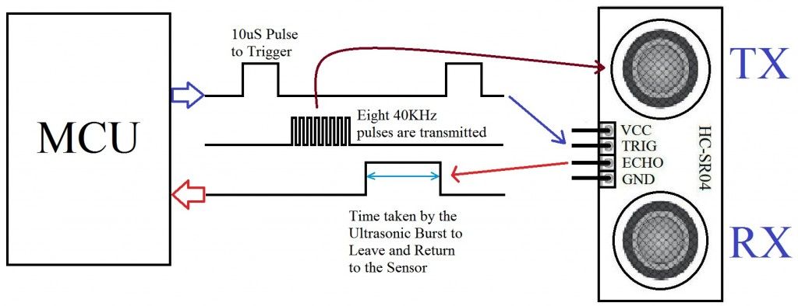
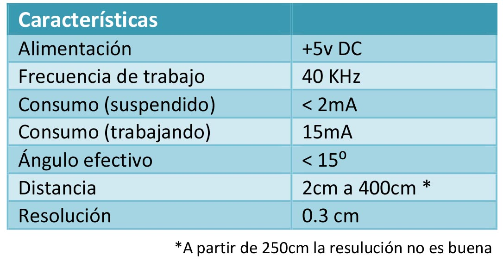
## ESQUEMÁTICO DE PRUEBA
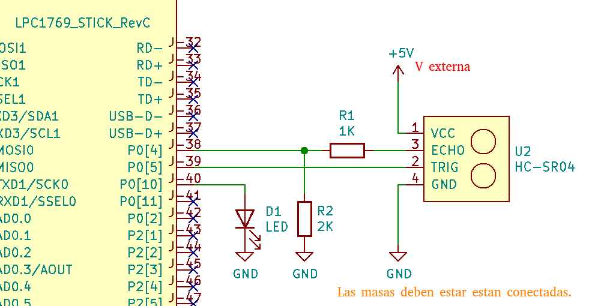

---
Espero le sea de útilidad.

Aportes y sugerencias siempre serán bienvenidas.

Autor: @ealegremendoza

E-mail: ealegremendoza@gmail.com
